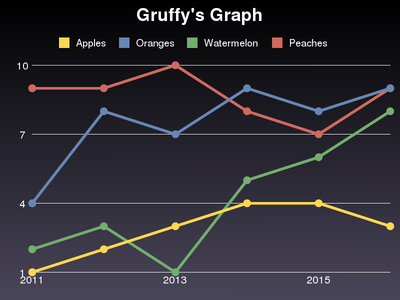

Introduction
============

Install
-------
This sction is how to install Gruffy. from PyPI or source package.

Require
~~~~~~~~
Gruffy is available on UNIX-like systems.
and, Gruffy depend on the following libraries.

- pgmagick_ : graphics module for Python, wrapper of GraphicsMagick.
- GraphicsMagick_ : graphing library. 1.3.5 and higher version.
- `Boost.Python`_ : used in pgmagick, 1.40 and higher version.

.. _GraphicsMagick: http://www.graphicsmagick.org/
.. _pgmagick: http://pypi.python.org/pypi/pgmagick/
.. _`Boost.Python`: http://www.boost.org/doc/libs/1_44_0/libs/python/doc/index.html

from PyPI
~~~~~~~~~
install using easy_install via PyPI

.. code-block:: bash

    easy_install -ZU gruffy

or, using pip.

.. code-block:: bash

    pip install --upgrade gruffy

from sourcecode package
~~~~~~~~~~~~~~~~~~~~~~~

.. code-block:: bash

    git clone git://github.com/hhatto/gruffy.git
    cd gruffy
    python setup.py install

Basic Usage
-----------

.. code-block:: python

    from gruffy import Line

    g = Line()
    g.title = "Gruffy's Graph"

    g.data("Apples", [1, 2, 3, 4, 4, 3])
    g.data("Oranges", [4, 8, 7, 9, 8, 9])
    g.data("Watermelon", [2, 3, 1, 5, 6, 8])
    g.data("Peaches", [9, 9, 10, 8, 7, 9])

    g.labels = {0: '2011', 2: '2013', 4: '2015'}

    g.write()

Now, execute script.

.. code-block:: bash

    python first.py

create to the :file:`graph.png` file.

And More
--------
More Documentation ...

:TODO: no document

