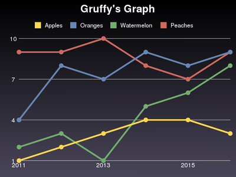

イントロダクション
==================

インストール
============
Gruffyはソースパッケージからインストールする方法とPyPI経由でインストールする方法があります。

前提条件
--------
GruffyはUNIX系のOSでのみ動作します。
また、以下のライブラリを利用しています。

- pgmagick_ : 画像処理モジュール。
- GraphicsMagick_ : pgmagickにて使用する画像処理ライブラリ。バージョン1.3.5以上で動作確認済。
- `Boost.Python`_ : pgmagickにて、GraphicsMagickのC++ライブラリ(Magick++)をPythonから利用するために使用。バージョン1.40以上で動作確認済。

.. _GraphicsMagick: http://www.graphicsmagick.org/
.. _pgmagick: http://pypi.python.org/pypi/pgmagick/
.. _`Boost.Python`: http://www.boost.org/doc/libs/1_44_0/libs/python/doc/index.html

PyPI経由でのインストール
------------------------
easy_installを使用しPyPI経由でインストールする方法は以下になります。

.. code-block:: bash

    easy_install -ZU gruffy

pipを使用することでもPyPI経由でインストールすることが可能です。
インストール方法は以下のとおりです。

.. code-block:: bash

    pip install --upgrade gruffy

ソースパッケージでのインストール
--------------------------------
GruffyのソースパッケージをgithubまたはPyPIからダウンロードし展開します。
setup.pyスクリプトをすることでインストールすることができます。

.. code-block:: bash

    python setup.py install

基本的な使い方
==============
インストールが完了したら、さっそくGruffyを使ってグラフを作ってみましょう。
以下のソースコードを :file:`first.py` として保存し、実行してください。

.. code-block:: python

    from gruffy import Line

    g = Line()
    g.title = "Gruffy's Graph"

    g.data("Apples", [1, 2, 3, 4, 4, 3])
    g.data("Oranges", [4, 8, 7, 9, 8, 9])
    g.data("Watermelon", [2, 3, 1, 5, 6, 8])
    g.data("Peaches", [9, 9, 10, 8, 7, 9])

    g.labels = {0: '2011', 2: '2013', 4: '2015'}

    g.write()

.. code-block:: bash

    python first.py

:file:`graph.png` が作成されました。

詳しい使い方
============
:TODO: ドキュメント未作成

